# CodeForum

CodeForum is an ASP.NET Core MVC application that serves as a platform for developers to discuss coding and software development topics.

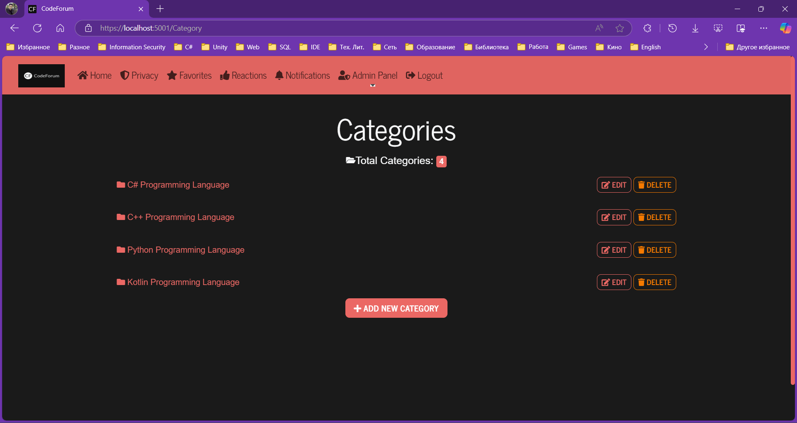
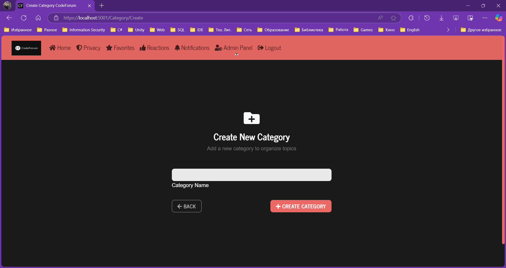
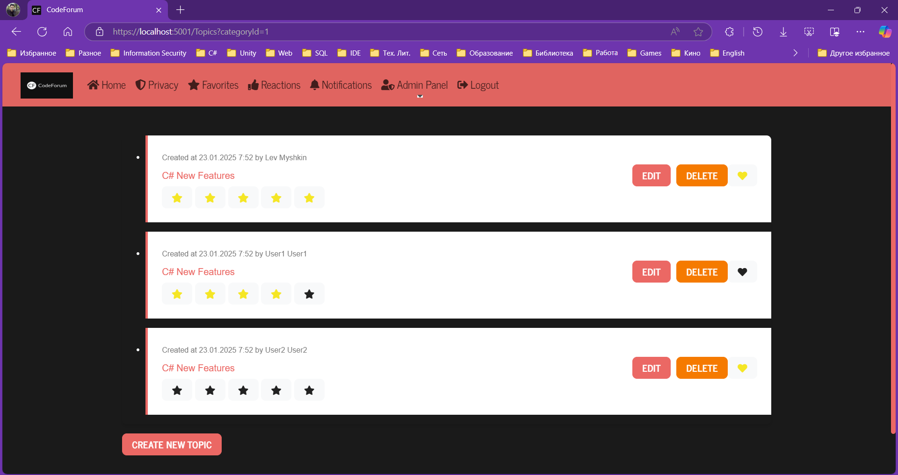
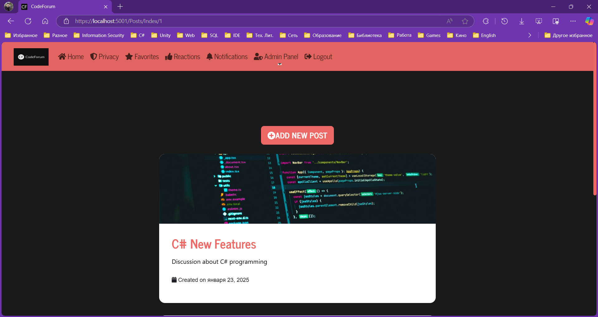
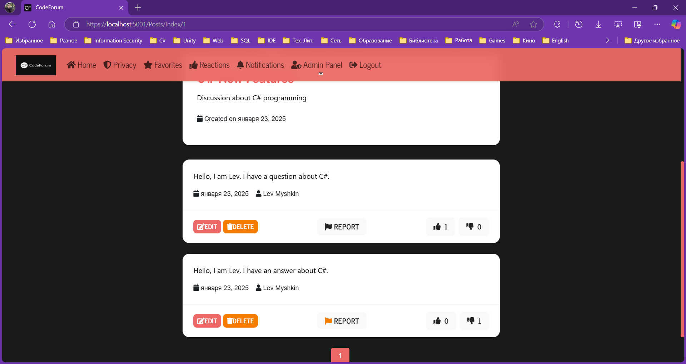
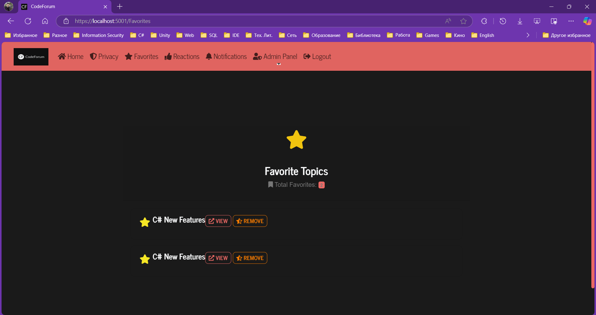
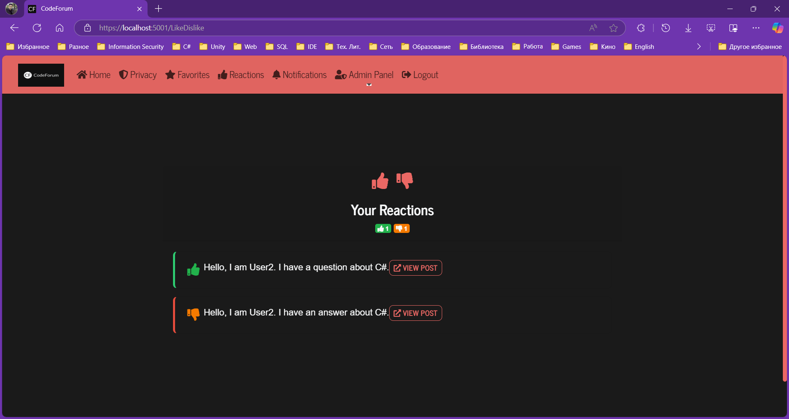
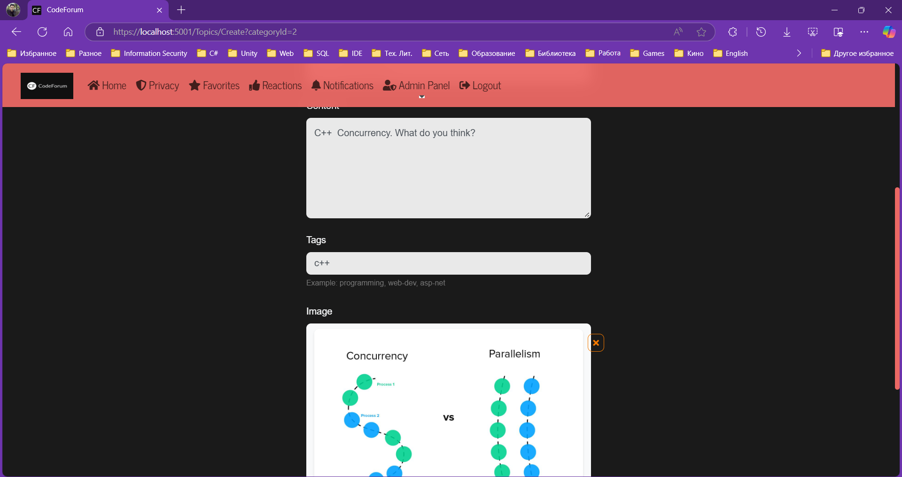
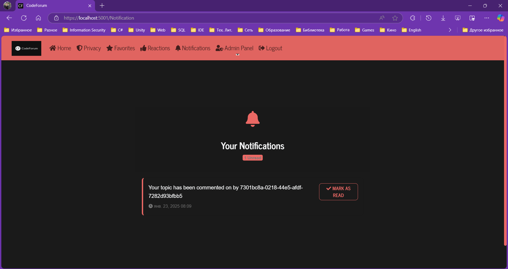
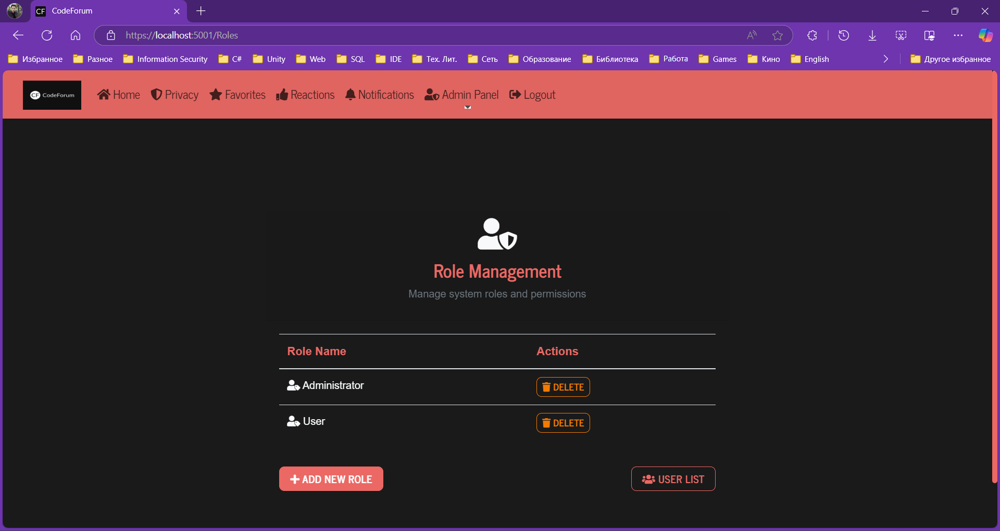
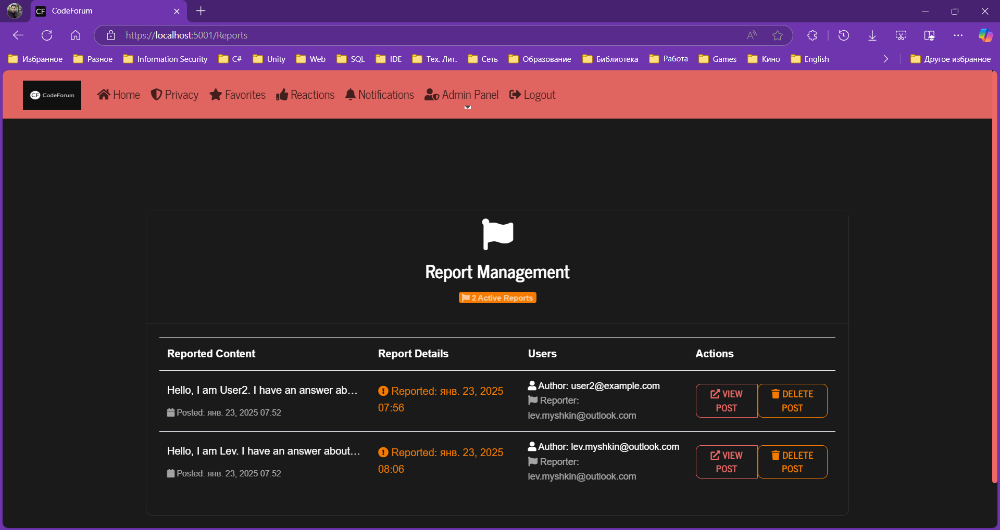

## Features

- User Authentication & Authorization
- Topic Categories
- Post Creation and Management
- Post Rating System
- Like/Dislike System
- User Favorites
- Post Reports
- Admin Panel
- Responsive Design
- User Notifications

## Usage
Users can create an account, log in, and start creating posts and discussions about various coding topics. Users can also comment on existing posts and engage in discussions.

## For Administrator Privileges
Email: lev.myshkin@outlook.com

Password: Myshkin0101

## Contributing
Contributions are welcome. Please fork the repository and create a pull request with your changes.

## Author

Bohdan Harabadzhyu

## License

[MIT](https://choosealicense.com/licenses/mit/)

## YouTube Review

📺 Watch Video Review

