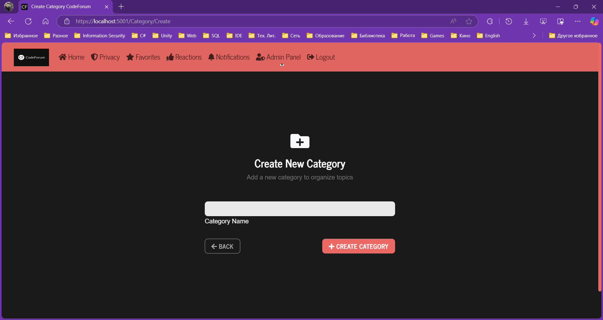
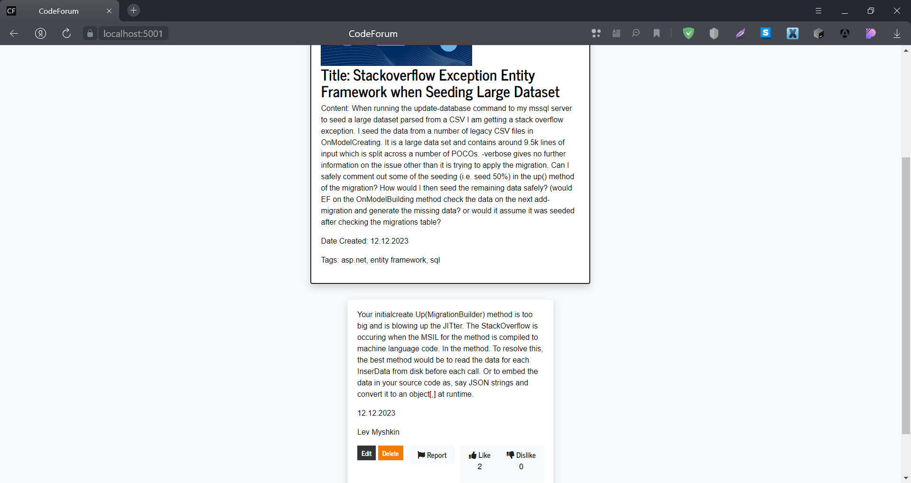

# CodeForum





CodeForum is an ASP.NET Core MVC application that serves as a platform for developers to discuss coding and software development topics.

## Installation

To install the project, follow these steps:
```bash
git clone https://github.com/TheMysteriousStranger90/CodeForum.git
cd CodeForum
dotnet restore
dotnet run
```
This will start the application on a local server. You can access it by navigating to localhost:5001 in your web browser.

## Running the Application with Docker

1. Build the Docker image from the Dockerfile:

    ```bash
    docker build -t codeforum .
    ```

2. Run the Docker container, mapping the application's port 80 to port 5001 on the host machine:

    ```bash
    docker run -p 5001:80 codeforum
    ```

3. Open a web browser and navigate to `http://localhost:5001` to access the application.

## Usage
Users can create an account, log in, and start creating posts and discussions about various coding topics. Users can also comment on existing posts and engage in discussions.

## For Administrator Privileges
Email: lev.myshkin@outlook.com

Password: Myshkin0101

## Development
To set up the development environment, follow the installation steps. Then, you can use Visual Studio Code or any other .NET-compatible IDE to develop the application.

To run the tests, use the following command:
```bash
dotnet test
```

## Contributing
Contributions are welcome. Please fork the repository and create a pull request with your changes.

## Author

Bohdan Harabadzhyu

## License

[MIT](https://choosealicense.com/licenses/mit/)

